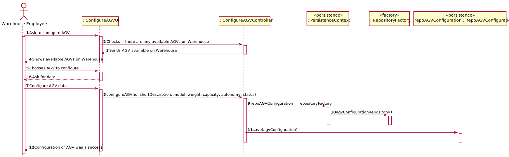

# US1001

### Sérgio Lopes 1200625

# 1. Requisitos

_____
**US1001** As Sales Clerk, I want to specify a new product for sale.

### 1.1 Especificações e esclarecimentos do cliente

> [Question:](https://moodle.isep.ipp.pt/mod/forum/discuss.php?d=16096#p20674)
> What position should be defined when configuring an AGV? The same position as his AGV Dock?
>
> [Awnser:](https://moodle.isep.ipp.pt/mod/forum/discuss.php?d=16096#p20678)
> By default, the AGV is on its base location, i.e., on the AGV dock.
>

> [Question:](https://moodle.isep.ipp.pt/mod/forum/discuss.php?d=15843#p20354)
Should it be possible to still create an AGV without assigning it to an AGV Dock (in case of none being available)?
> Should it be possible to edit an AGV configuration, or is that outside the scope of US2002?
>
> [Awnser:](https://moodle.isep.ipp.pt/mod/forum/discuss.php?d=16073#p20676)
No! The AGV Dock is mandatory.
> It outside of scope. But, if you want, you can do it.

> [Question:](https://moodle.isep.ipp.pt/mod/forum/discuss.php?d=15988#p20541)
should the id be generated automatically? when we want to configure an agv, should we ask for a list of available agv where we will choose one or will it (automatically) be given one that is available? how many agvs can the base location of wharehouse have? when we want to set the agv, does this mean we will create one or will we redefine one that exists and is available (without any task)? should the weight, volume, model and capacity of the agv be constant?
>
> [Awnser:](https://moodle.isep.ipp.pt/mod/forum/discuss.php?d=15988#p20584)
> No!
There is no list of AGV to choose from. The user specifies the AGV that exist in the warehouse. So, the user is creating the list of AGVs. As said before, 1 AGV per dock. I do not understand this question in the scope of US 2002. Such information varies from one AGV to another. Otherwise, it would not make any sense.

> [Question:](https://moodle.isep.ipp.pt/mod/forum/discuss.php?d=15988#p20590)
> when we want to configure an agv, should we ask for a list of available agv where we will choose one or will it (automatically) be given one that is available? There is no list of AGV to choose from. The user specifies the AGV that exist in the warehouse. So, the user is creating the list of AGVs.4)
when we want to set the agv, does this mean we will create one or will we redefine one that exists and is available (
without any task)? I do not understand this question in the scope of US 2002. I'm not sure I understand the answer very well. maybe the 2 and 4 are related since I saw an answer from you to a previous question regarding the status of the agv and what I wanted to know is imagining that we have 5 docs we will have 5 agvs imagining that the 5 are already busy with another task (status: charging, doing a task) is it possible to configure it even being busy (status different from free) or is it only possible to configure the agv when it is with status: free ?

> [Awnser:](https://moodle.isep.ipp.pt/mod/forum/discuss.php?d=15988#p20616)
> Through US 2001, the system knows the warehouse plant and, therefore, which are the existing AGV docks (e.g. 5 docks). Through US 2002, the system knows which AGVs are operating in the warehouse and the characteristics of each one, including the dock that each AGV has as its base location. Notice that, for instance, despite of existing 5 docks in the warehouse, the number of AGVs operating in the warehouse might be lesser than 5. Through US 2003 and/or US 4002 tasks are assigned to the AGV operating in the warehouse. A task can only be assigned when the AGV is free... The status of an AGV changes due several factors (e.g. battery).

> [Question:](https://moodle.isep.ipp.pt/mod/forum/discuss.php?d=15688#p20163)
> A single AGV dock, no matter how large, can only be the base for one AGV robot.
> [Awnser:](https://moodle.isep.ipp.pt/mod/forum/discuss.php?d=15688#p20220)
> Yes. That is correct.
>
>
>
> > [Question:](https://moodle.isep.ipp.pt/mod/forum/discuss.php?d=15672#p20145)
> What do you understand about configuring the AGV's available on the warehouse. What changes the warehouse employee can do in his specifics and actions/taks?
> [Awnser:](https://moodle.isep.ipp.pt/mod/forum/discuss.php?d=15672#p20157)
> Within this context, "configuring the AGVs available on the warehouse" means that the Warehouse Employee needs to specify which are the AGV operating in the warehouse and, therefore, define some basic information regarding each AGV. Please, read carefully the specifications' document to find ou which information is need. An highlight is provided below.
"The AGVs operating on the warehouse, its characteristics (e.g.: identifier, short description, model, and maximum weight it can carry) and its base location (i.e., the AGV dock). In addition, it is necessary to know the AGV status regarding its autonomy (e.g.: 2 hours left) and current task (e.g.: free, charging, occupied serving a given order)." (cf. Specifications' document)

# 2. Análise

_____

### 2.1 Excerto do Modelo de Domínio

# 3. Design

### 3.1. Realização da Funcionalidade

### 3.3. Padrões Aplicados

*Nesta secção deve apresentar e explicar quais e como foram os padrões de design aplicados e as melhores práticas.*

### 3.4. Testes

	package eapli.base.agvConfiguration.domain;

    import eapli.base.productsCategory.domain.AlphanumericCode;
    import eapli.base.productsCategory.domain.Description;
    import eapli.base.productsCategory.domain.ProductsCategory;
    import org.junit.jupiter.api.Assertions;
    import org.junit.jupiter.api.Test;
    
    class AGVTest {

    @Test
    void testToString() {
        Id id = new Id("1234");
        MaxVolume mV = new MaxVolume(54.02);
        MaxWeight mW = new MaxWeight(54.02);
        ShortDescription sD = new ShortDescription("ze manel dos produtos");
        Model m = new Model("ze manel dos produtos é o melhor sales clerk");
        Status s = new Status("charging");
        Route r = new Route(1);
        Autonomy a2 = new Autonomy("5 hours");
        Task t = new Task("charging");
        AGV a = new AGV();
        AGV a1 = new AGV(id, mW, mV, m, r, sD, s, a2, t);
        Assertions.assertNotEquals(a1.toString(), a.toString());
    }

    @Test
    void testToString2() {
        Id id = new Id("1234");
        MaxVolume mV = new MaxVolume(54.02);
        MaxWeight mW = new MaxWeight(54.02);
        ShortDescription sD = new ShortDescription("ze manel dos produtos");
        Model m = new Model("ze manel dos produtos é o melhor sales clerk");
        Status s = new Status("charging");
        Route r = new Route(1);
        Autonomy a = new Autonomy("5 hours");
        Task t = new Task("charging");
        AGV a1 = new AGV(id, mW, mV, m, r, sD, s, a, t);
        String expected = "AGV-> id: 1234;\n" +
                "\tmaxVolume= 54.02;\n" +
                "\tmaxWeight= 54.02;\n" +
                "\tmodel: ze manel dos produtos é o melhor sales clerk;\n" +
                "\troute: 1;\n" +
                "\tshortDescription: ze manel dos produtos;\n" +
                "\tstatus: charging;\n" +
                "\tautonomy: 5 hours;\n" +
                "\ttask: charging;";
        Assertions.assertEquals(a1.toString(), expected);
    }

    @Test
    void sameAs() {
        Id id = new Id("1234");
        MaxVolume mV = new MaxVolume(54.02);
        MaxWeight mW = new MaxWeight(54.02);
        ShortDescription sD = new ShortDescription("ze manel dos produtos");
        Model m = new Model("ze manel dos produtos é o melhor sales clerk");
        Status s = new Status("charging");
        Route r = new Route(1);
        Autonomy a = new Autonomy("5 hours");
        Task t = new Task("charging");
        AGV a1 = new AGV(id, mW, mV, m, r, sD, s, a, t);
        Object a2 = new AGV(id, mW, mV, m, r, sD, s, a, t);
        Assertions.assertTrue(a1.sameAs(a2));
    }

    @Test
    void sameAs2() {
        Id id = new Id("1234");
        MaxVolume mV = new MaxVolume(54.02);
        MaxWeight mW = new MaxWeight(54.02);
        ShortDescription sD = new ShortDescription("ze manel dos produtos");
        Model m = new Model("ze manel dos produtos é o melhor sales clerk");
        Status s = new Status("charging");
        Route r = new Route(1);
        Autonomy a = new Autonomy("5 hours");
        AlphanumericCode ac = new AlphanumericCode("1324");
        Description c = new Description("da lhe serginho na queima");
        Task t = new Task("charging");

        AGV a1 = new AGV(id, mW, mV, m, r, sD, s, a, t);
        Object a2 = new ProductsCategory(ac, c);
        Assertions.assertFalse(a1.sameAs(a2));
    }

    @Test
    void identity() {
        Id id = new Id("1234");
        MaxVolume mV = new MaxVolume(54.02);
        MaxWeight mW = new MaxWeight(54.02);
        ShortDescription sD = new ShortDescription("ze manel dos produtos");
        Model m = new Model("ze manel dos produtos é o melhor sales clerk");
        Status s = new Status("charging");
        Route r = new Route(1);
        Autonomy a = new Autonomy("5 hours");
        Task t = new Task("charging");
        AGV a1 = new AGV(id, mW, mV, m, r, sD, s, a, t);
        AGV a2 = new AGV(id, mW, mV, m, r, sD, s, a, t);
        Assertions.assertEquals(a1.identity(), a2.identity());
    }

    @Test
    void identity2() {
        Id id = new Id("1234");
        Id id2 = new Id("12ere34");
        MaxVolume mV = new MaxVolume(54.02);
        MaxWeight mW = new MaxWeight(54.02);
        ShortDescription sD = new ShortDescription("ze manel dos produtos");
        Model m = new Model("ze manel dos produtos é o melhor sales clerk");
        Status s = new Status("charging");
        Route r = new Route(1);
        Autonomy a = new Autonomy("5 hours");
        Task t = new Task("charging");
        AGV a1 = new AGV(id, mW, mV, m, r, sD, s, a, t);
        AGV a2 = new AGV(id2, mW, mV, m, r, sD, s, a, t);
        Assertions.assertNotEquals(a1.identity(), a2.identity());
    }

        }

# 4. Implementação

    public class AGVConfigurationController {
    
        private final AGVConfigurationRepository repoAGV = PersistenceContext.repositories().agvConfigurationRepository();
        private final WarehousePlantRepository repoWare = PersistenceContext.repositories().warehousePlantRepository();
        AGVServices services = new AGVServices();
    
    
        public Iterable<WarehousePlant> findAllWarehouse() {
            return repoWare.findAll();
        }
    
    
        public AGV newAGVConfiguration(Id id, MaxWeight maxWeight, MaxVolume maxVolume, Model model, Route route, ShortDescription shortDescription, Status status, Autonomy autonomy, Task task) {
    
            AGV agv = new AGV(id, maxWeight, maxVolume, model, route, shortDescription, status, autonomy, task);
    
            return repoAGV.save(agv);
        }
    
        public Iterable<AGV> findAllAGV() {
            return repoAGV.findAll();
        }
    
        public boolean checkAGVId(Id id) {
            AGV agvFound = services.findAGVID(id);
    
            return agvFound != null;
        }
    
        public AGV findAGV(Id id) {
            AGV agvF = services.findAGVID(id);
    
            return agvF;
        }
    
    
    }

        public AGV(Id id, MaxWeight maxWeight, MaxVolume maxVolume, Model model, Route route, ShortDescription shortDescription, Status status, Autonomy autonomy, Task task) {
        this.id = id;
        this.maxWeight = maxWeight;
        this.maxVolume = maxVolume;
        this.model = model;
        this.route = route;
        this.shortDescription = shortDescription;
        this.status = status;
        this.autonomy = autonomy;
        this.task = task;
        }
        
            //TODO route na task inicio e fim
            //TODO saber qual a doc que começa e a locação
        
            public Id getId() {
                return id;
            }
        
            public void setRoute(Route route) {
                this.route = route;
            }
        
            public void setShortDescription(ShortDescription shortDescription) {
                this.shortDescription = shortDescription;
            }
        
            public void setStatus(Status status) {
                this.status = status;
            }
        
            public void setAutonomy(Autonomy autonomy) {
                this.autonomy = autonomy;
            }
        
            public void setTask(Task task) {
                this.task = task;
            }
        
            /**
             * @return AGV toString
             */
            @Override
            public String toString() {
                return "AGV-> " + id +"\n\t"+ maxVolume+"\n\t" + maxWeight+"\n\t" + model +"\n\t"+ route +"\n\t"+ shortDescription+"\n\t" + status +"\n\t"+ autonomy+"\n\t" + task;
            }
        
            /**
             * @param other
             * @return
             */
            @Override
            public boolean sameAs(Object other) {
                return DomainEntities.areEqual(this, other);
            }
        
        
            /**
             * @return
             */
            @Override
            public Id identity() {
                return this.id;
            }
        }

# 5. Integração/Demonstração

_____

# 6. Observações

_____

