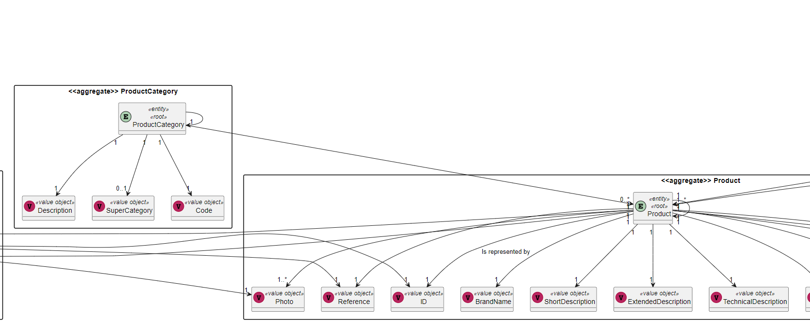
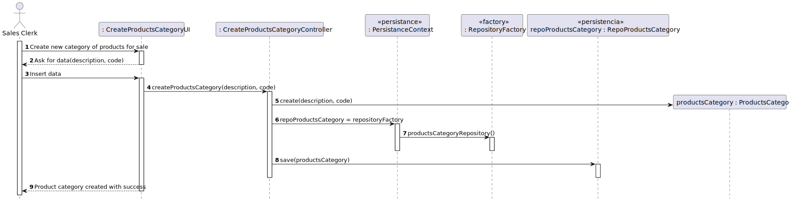

# US1005
### Sérgio Lopes 1200625

# 1. Requisitos
_____
**US1001** As Sales Clerk, I want to specify a new product for sale.

### 1.1 Especificações e esclarecimentos do cliente

> [Question:](https://moodle.isep.ipp.pt/mod/forum/discuss.php?d=15987)
> Regarding US1005, is there any rules for the alphanumeric code, or the Sales Clerk chooses what to input.
>
> [Awnser:](https://moodle.isep.ipp.pt/mod/forum/discuss.php?d=15987#p20583)
> There are some basic rules:
> - Code: not empty alphanumeric code with at 10 chars maximum;
> - Description: not empty with a minimum of 20 chars and 50 chars maximum;

> [Question:](https://moodle.isep.ipp.pt/mod/forum/discuss.php?d=15967)
Regarding US1005, when creating a new product category, is it supposed to be able to add products at the moment of the creation? Or just after the category is created?
>  
> [Awnser:](https://moodle.isep.ipp.pt/mod/forum/discuss.php?d=15967#p20520)
No, it is not supposed to add products while creating the category.

> [Question:](https://moodle.isep.ipp.pt/mod/forum/discuss.php?d=15796)
In this forum post you said that there is no hierarchy between categories 
> (https://moodle.isep.ipp.pt/mod/forum/discuss.php?d=15693). But in the project description it's said that there 
> is an optional reference to a super-category(Section 3.1). Could you please clarify if it is possible to a category 
> have a reference to another category? (super-category).
>
> [Awnser:](https://moodle.isep.ipp.pt/mod/forum/discuss.php?d=15796#p20357)
>For now, there is no need of hierarchies on categories.

# 2. Análise
_____

### 2.1 Excerto do Modelo de Domínio

# 3. Design
_____

### 3.1. Realização da Funcionalidade

A implementação da funcionalidade em causa consiste na inserção dos dados requeridos na consola
sobre os dados pedidos ao utilizador, o seu sucesso significa que a categoria do produto foi
criada e adicionada à base de dados.

### 3.1.1 Sequence Diagram

### 3.2. Padrões Aplicados

* DDD - Domain Driven Design.
  >A elaboração do projeto começou logo com DDD em mente. O modelo de domínio foi elaborado com as regras de negócio e o overlay do DDD para representação de agregados, entities e roots seguindo as regras necessárias.

* GRASP
  >Com cada representação de um ator ou user story, o GRASP era sempre tido em consideração, visto ser uma base fundamental para o bom desenvolvimento do projeto.
  > Quer seja o Information Expert, Low coupling/High cohesion ou o conceito de controller, todos estes princípios estão bastante presentes na mente dos elementos do grupo.

* SOLID
  > O SOLID esteve present principalmente com o Single Responsability Principle, sendo que foi sempre tido em atenção as responsabilidades que uma classe deve ter.
  >Já implementado com o projeto base de EAPLI, a Interface Seggregation Principle veio-se provar útil e esclarecedora, tendo em conta os diversos repositórios que tiveram que ser criados.
  
### 3.3. Testes 

**Teste 1:** Verificar que não é possível criar uma instância da classe Exemplo com valores nulos.

	@Test
    public void testToStringNotEquals() {

        AlphanumericCode code = new AlphanumericCode("sda54");
        Description description = new Description("This is a test, cause this is a test");
        ProductsCategory cat = new ProductsCategory();
        ProductsCategory cat2 = new ProductsCategory(code,description);
        Assert.assertNotEquals(cat.toString(),cat2.toString());
    }

    @Test
    public void testToStringEquals() {

        AlphanumericCode code = new AlphanumericCode("sda54");
        Description description = new Description("This is a test, cause this is a test");
        ProductsCategory cat = new ProductsCategory(code,description);
        ProductsCategory cat2 = new ProductsCategory(code,description);
        Assert.assertEquals(cat.toString(),cat2.toString());
    }

# 4. Implementação

>A integração da funcionalidade com o sistema foi bastante facilitada pelo projeto base de EAPLI, visto que, após ter uma boa compreensão de como este funciona, um membro da equipa consegue levar a cabo a criação de uma entidade com os seus respetivos atributos fácil e rapidamente.
> Quer seja com a persistência na base de dados ou a facilidade de observar as diversas camadas de negócio divididas por módulos.

# 5. Integração/Demonstração

> A integração da funcionalidade com o sistema foi bastante facilitada pelo projeto base de EAPLI, visto que, após ter uma boa compreensão de como este funciona, um membro da equipa consegue levar a cabo a criação de uma entidade com os seus respetivos atributos fácil e rapidamente.
> Quer seja com a persistência na base de dados ou a facilidade de observar as diversas camadas de negócio divididas por módulos.

# 6. Observações
> Nada a apontar.

