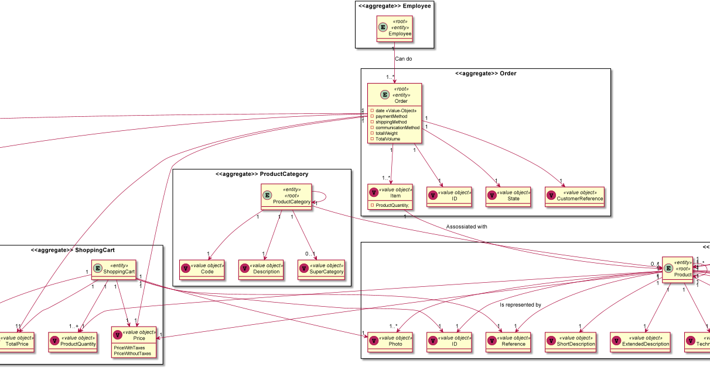
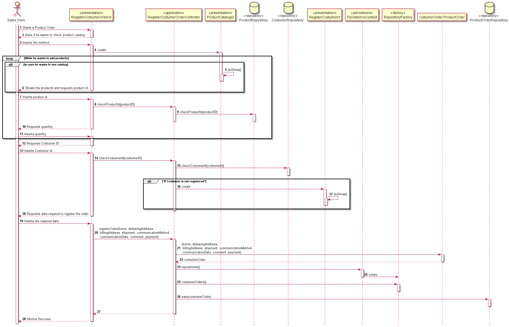

# CreateCostumerOrder
### Vasco Azevedo 1202016

# 1. Requisitos
_____
**US1004** As Sales Clerk, I want to create a new products order on behalf of a given customer.

### 1.1 Especificações e esclarecimentos do cliente
> [Question 1](https://moodle.isep.ipp.pt/mod/forum/discuss.php?d=15938)
> 
> [Question 2](https://moodle.isep.ipp.pt/mod/forum/discuss.php?d=15962)
> 
> [Question 3](https://moodle.isep.ipp.pt/mod/forum/discuss.php?d=15530)
> 
> [Question 4](https://moodle.isep.ipp.pt/mod/forum/discuss.php?d=15531)
> 
> [Question 5](https://moodle.isep.ipp.pt/mod/forum/discuss.php?d=15532)
> 
> [Question 6](https://moodle.isep.ipp.pt/mod/forum/discuss.php?d=15630)

# 2. Analysis
_____

### 2.1 Domain Model Excerpt

# 3. Design
_____

### 3.1 Sequence Diagram

### 3.2. Design Patterns

* DDD - Domain Driven Design.
  > The Domain model was made with the business rules and withe the DDD overlay to represent the Aggregates, Entities and roots.

* GRASP
  > We had GRASP in consideraton, because it is fundamental for the development of a good project.
  >Every group member utilized the Information Expert, Low coupling/High cohesion and the controller consept.

* SOLID

  > SOLID was also present. We always had in consideration the responsibilities each class should have.
  
# 4. Implementation

> The implementation was easier because of the base project from EAPLI. If we had a closer look on the base project, we could 
> understand how each US was implemented, and it was really easy to follow everything because of the designs.
# 5. Integração/Demonstração

> The Integration and the demonstration were easier because of the base project from EAPLI. If we had a closer look on the base project, we could
> understand how each US was implemented, and it was really easy to follow everything because of the designs.

# 6. Observações
> No Observations

