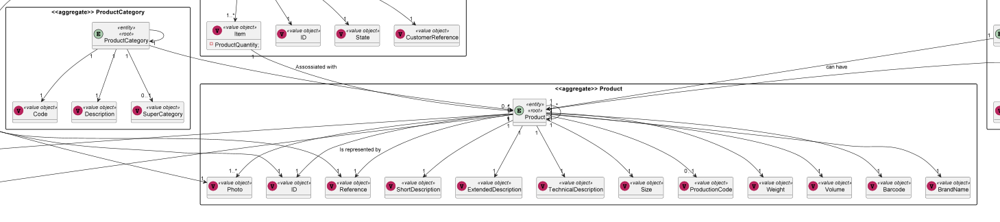
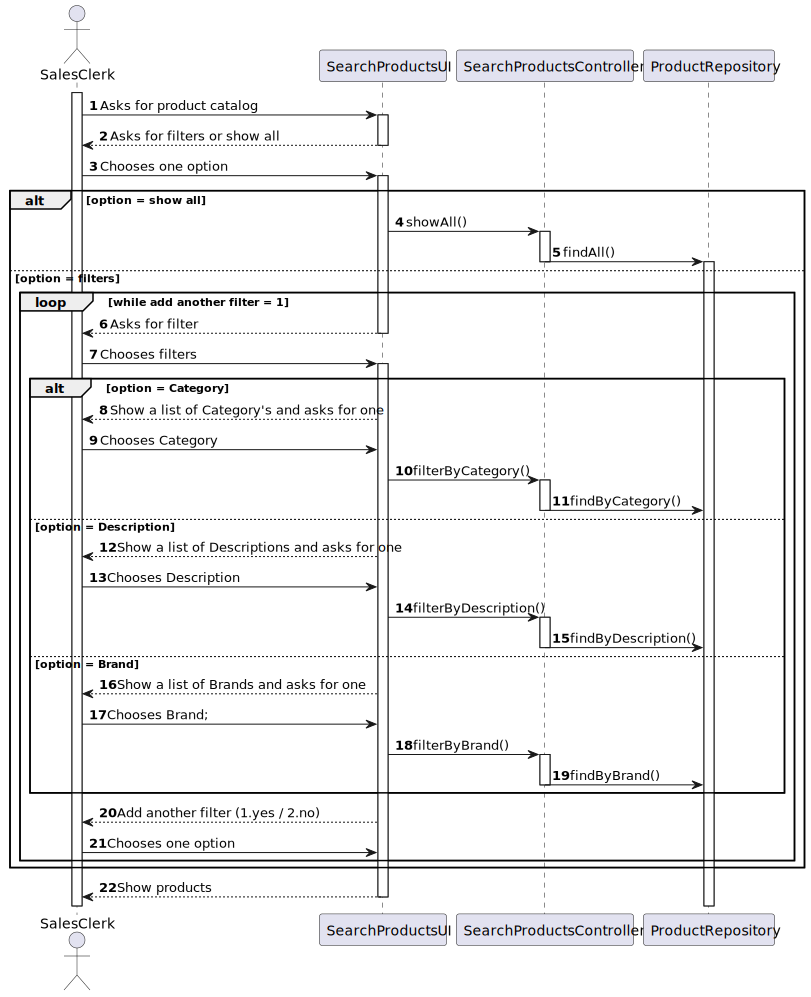

# US1002
### Pedro Sousa 1201428

# 1. Requisitos
_____
**US1002** As Sales Clerk, I want to view/search the products catalog.

### 1.1 Especificações e esclarecimentos do cliente

> [Question:](https://moodle.isep.ipp.pt/mod/forum/discuss.php?d=15712#p20187)
> In the User Story 1002 it is required that the catalog must support filtering and sorting operations by one or more product attributes, but can you be more specific in relation to the catalog sorting?
>
> [Awnser:](https://moodle.isep.ipp.pt/mod/forum/discuss.php?d=15690#p20165)
> Please refer to this topic: https://moodle.isep.ipp.pt/mod/forum/discuss.php?d=15690#p20165

> [Question:](https://moodle.isep.ipp.pt/mod/forum/discuss.php?d=15690#p20165)
Regarding US1005, when creating a new product category, is it supposed to be able to add products at the moment of the creation? Or just after the category is created?
>
> [Awnser:](https://moodle.isep.ipp.pt/mod/forum/discuss.php?d=15690#p20165)
>Commonly fields used to filter products are:
>
>Category
>Description (any of the available descriptions)
>Brand
>User should select/specify a data presentation order. This applies to any similar US.
>
>At least the product' code, short description, brand, category and unit price should be presented.
>
>More details can be presented for a given/selected product at user request.

# 2. Análise
_____

### 2.1 Excerto do Modelo de Domínio

# 3. Design
_____

### 3.1. Realização da Funcionalidade

A implementação consiste na pesquisa de produtos, seja essa pesquisa feita usando filtros ou não.

### 3.1.1 Sequence Diagram

### 3.2. Padrões Aplicados

* DDD - Domain Driven Design.
  >A elaboração do projeto começou logo com DDD em mente. O modelo de domínio foi elaborado com as regras de negócio e o overlay do DDD para representação de agregados, entities e roots seguindo as regras necessárias.

* GRASP
  >Com cada representação de um ator ou user story, o GRASP era sempre tido em consideração, visto ser uma base fundamental para o bom desenvolvimento do projeto.
  > Quer seja o Information Expert, Low coupling/High cohesion ou o conceito de controller, todos estes princípios estão bastante presentes na mente dos elementos do grupo.

* SOLID
  > O SOLID esteve present principalmente com o Single Responsability Principle, sendo que foi sempre tido em atenção as responsabilidades que uma classe deve ter.
  >Já implementado com o projeto base de EAPLI, a Interface Seggregation Principle veio-se provar útil e esclarecedora, tendo em conta os diversos repositórios que tiveram que ser criados.

### 3.3. Testes

	

# 4. Implementação

>A integração da funcionalidade com o sistema foi bastante facilitada pelo projeto base de EAPLI, visto que, após ter uma boa compreensão de como este funciona, um membro da equipa consegue levar a cabo a criação de uma entidade com os seus respetivos atributos fácil e rapidamente.
> Quer seja com a persistência na base de dados ou a facilidade de observar as diversas camadas de negócio divididas por módulos.

# 5. Integração/Demonstração

> A integração da funcionalidade com o sistema foi bastante facilitada pelo projeto base de EAPLI, visto que, após ter uma boa compreensão de como este funciona, um membro da equipa consegue levar a cabo a criação de uma entidade com os seus respetivos atributos fácil e rapidamente.
> Quer seja com a persistência na base de dados ou a facilidade de observar as diversas camadas de negócio divididas por módulos.

# 6. Observações

> Nada a apontar.

