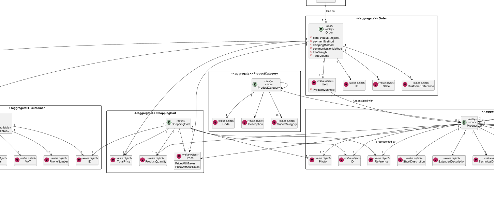
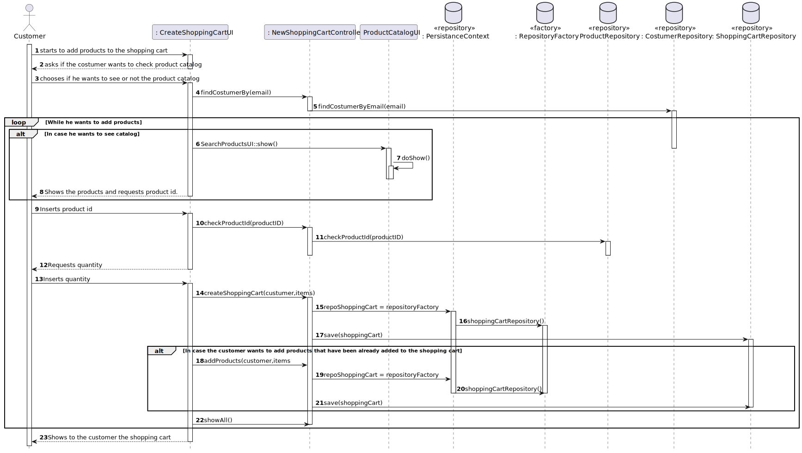

# US1501 
### Sérgio Lopes 1200625

# 1. Requisitos
_____
**US1501** As Customer, I want to view/search the product catalog and be able to add a product to the shopping cart.

**After talking with teacher Paulo Maio about our number of rcomp students, he said that US1901 was
not mandatory and in order to persist the shopping cart, we should save it on our database.**

### 1.1 Especificações e esclarecimentos do cliente

> [Question:](https://moodle.isep.ipp.pt/mod/forum/discuss.php?d=16695#p21422)
> Dear Client,
>
>We wanted to know which attributes are needed on the shopping cart to show to the user (customer)?
>
>Best Regards,
>
>G03 2DF
>
> [Awnser:](https://moodle.isep.ipp.pt/mod/forum/discuss.php?d=16695#p21451)
> Come on, you must have/acquire autonomy to decide this based on the business description already made.
>
>In addition, you can always put yourself in the role of a customer (and not of a developer) and think a little about
>what information you, as a customer, would like to see. And that's it, that's the information you have to show.

> [Question:](https://moodle.isep.ipp.pt/mod/forum/discuss.php?d=16611#p21319)
>Dear Client,
>
>We wanted to ask you if we will need to give the ability to customers to create new users or we just have to stick to the main problem and create a default user for customers at the moment?
>
>Best regards,
>
>G03 2DF
> [Awnser:](https://moodle.isep.ipp.pt/mod/forum/discuss.php?d=16611#p21385)
>Probably, I am missing something here.
>
>US1501 is about a customer view/search the products catalog and add products to the shopping cart.
>
>Each customer is a system user. Customers are created, for instance, in the scope of US 1003

> [Question:](https://moodle.isep.ipp.pt/mod/forum/discuss.php?d=16611#p21319)
>Dear Client,
>
>I hope your day is going well. Our team would like to now if anything said by you in these previous clarifications related to the US1002 are still valid for the US1501 having in consideration that now is the Client using the system and not a Clerk.
>
>
>
>https://moodle.isep.ipp.pt/mod/forum/discuss.php?d=15745
>
>https://moodle.isep.ipp.pt/mod/forum/discuss.php?d=16092
>
>https://moodle.isep.ipp.pt/mod/forum/discuss.php?d=15690
>
>Would anything change between to two user interfaces when searching the catalog and adding to the shopping cart?
>
>Best regards
>
>G03, 2DA
>
> [Awnser:](https://moodle.isep.ipp.pt/mod/forum/discuss.php?d=16584#p21296)

# 2. Análise
_____

### 2.1 Excerto do Modelo de Domínio

# 3. Design
_____

### 3.1. Realização da Funcionalidade

A implementação desta User Story permite criar uma funcionalidade ao Customer de ver os produtos 
disponiveis para adicionar à shopping cart. Além diss, esta funcionalidade tem uma feature que 
permite ao Customer, se assim desejar, abandonar a sessão e voltar se a logar e voltar a ter 
o exato mesmo shopping cart e se assim desejar adicionar produtos à sua vontade.

### 3.2 Diagrama de Sequência

### 3.3. Padrões Aplicados

* DDD - Domain Driven Design.
  >A elaboração do projeto começou logo com DDD em mente. O modelo de domínio foi elaborado com as regras de negócio e o overlay do DDD para representação de agregados, entities e roots seguindo as regras necessárias.

* GRASP
  >Com cada representação de um ator ou user story, o GRASP era sempre tido em consideração, visto ser uma base fundamental para o bom desenvolvimento do projeto.
  > Quer seja o Information Expert, Low coupling/High cohesion ou o conceito de controller, todos estes princípios estão bastante presentes na mente dos elementos do grupo.

* SOLID
  > O SOLID esteve present principalmente com o Single Responsability Principle, sendo que foi sempre tido em atenção as responsabilidades que uma classe deve ter.
  >Já implementado com o projeto base de EAPLI, a Interface Seggregation Principle veio-se provar útil e esclarecedora, tendo em conta os diversos repositórios que tiveram que ser criados.

### 3.4. Testes 

**Teste 1:** Verificar que não é possível criar uma instância da classe ShoppingCart com valores nulos.

	@Test(expected = IllegalArgumentException.class)
		public void ensureNullIsNotAllowed() {
		Exemplo instance = new Exemplo(null, null);
	}

# 4. Implementação
_____
>A implementação desta User Story teve as suas dificuldades no que toca à persistência do 
> shopping cart e, depois de criada pela primeira vez, incrementar, à quantidade de produtos
> já existentes, os que o utilizador deseja adicionar posteriormente. No entanto, consegui totalmente 
> implementar esta User Story sem nenhum problema aparente.

# 5. Observações
_____
>Nada a apontar

