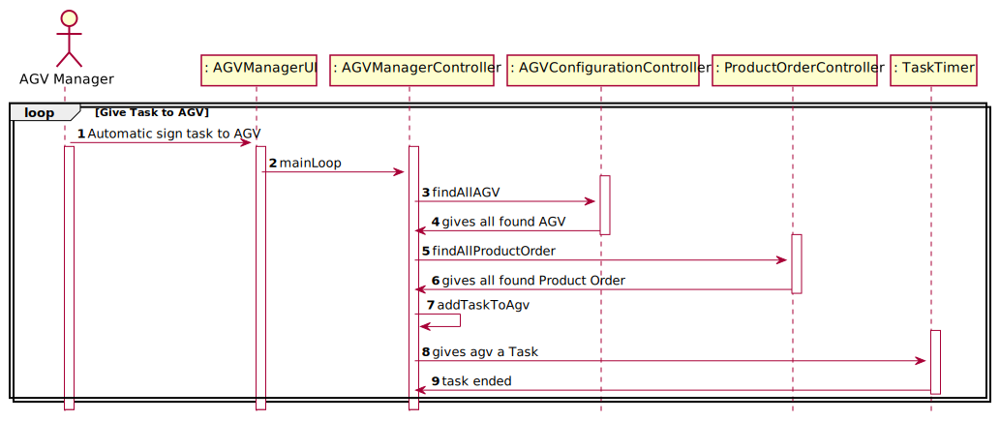

# US4002

### Tiago Freitas 1200628

# 1. Requisitos

_____
**US4002**

* As Project Manager, I want that the "AGVManager" component is enhanced with a basic FIFO algorithm to automatically
  assign tasks to AGVs.

### 1.1 Especificações e esclarecimentos do cliente

> Q1: I have a question about the necessity of using Events and Watchdogs for this US and if this US is a functionality of a server.
>
> A1:
This is a technical question and, as so, it is out of scope of this forum.
> You should ask it to technical advisers (i.e. lab classes teachers of any course unit).

> Q2: In US4002 it is required that the AGV Manager should support automatic assignment of orders to AGVs. In US2003 the Warehouse Employee will be able to assign any order to an AGV available. If the orders are being automatically assigned to an AGV (US4002) how can the Warehouse Employee assign a specific order to an AGV?
>
> A2: Great question!
> Usually, and by default, one intends that system automatically assigns orders to AGVs (US 4002).
> However, if such option is not available (e.g.: turned off) or by some reason an order needs to be prepared faster than it would normally be, the warehouse employee has the ability to assign tasks manually (US 2003).
> Notice that, orders that can be prepared by AGVs are being added to a queue following a FIFO algorithm (part of the US 4002). In the scope of US 2003 the FIFO algorithm does not apply... the employee might choose the order (s)he wants.

> Q3: After analyzing the User Story 4002 -> "As Project Manager, I want that the "AGVManager" component is enhanced with a basic FIFO algorithm to automatically assign tasks to AGVs." the following doubts came to me:
> Will the FIFO algorithm be used to control the tasks/orders that are waiting for an available AGV? If I am interpreting something wrong please clarify for me.
> Talking about being automatic, the System executes this functionally after some other functionality, or executes it periodically? If it is periodically, how often?
>
> A3: Here are some answers/explanations:
> Q1: The general idea is that product orders reaching a certain state whose meaning is of "need to be prepared by an AGV" are added to a queue. Then, following the FIFO algorithm orders are removed from the queue and assigned to available AGVs capable of performing the task that such order implies.
> Q2: Teams are free to propose a solution for that problem/issue. Notice that all team decisions must be well supported in light of business need and technical constraints.

# 2. Análise

_____

### 2.1 Excerto do Modelo de Domínio

# 3. Design

_____

### 3.1. Realização da Funcionalidade

### 3.3. Padrões Aplicados

*Nesta secção deve apresentar e explicar quais e como foram os padrões de design aplicados e as melhores práticas.*

### 3.4. Testes

# 4. Implementação

> recebemos todos os agvs
> recebemos todas as product orders e organizamos por data
> recebemos todas as tasks
> verificamos se os agvs recebidos estão com o status disponivel
> verificamos se as product orders ja estao pagas, se sim é alterada para to be prepared
> verificamos se o agv aguenta com a product order
> quando atribuido a task ao agv o product order é alterado para beeing prepared, o agv altera o seu status para doing a taks e a task é alterada para a task que está a ser efetuada
> agv executa a task durante 10 s
> ao fim do task timer o agv altera o seu status para free, altera a task para No task e a product order é alterada para prepared
> sendo este metodo numa verificação constante de novas product orders e de agvs disponiveis, numa verificacao automatica

# 5. Integração/Demonstração

_____

# 6. Observações

_____

