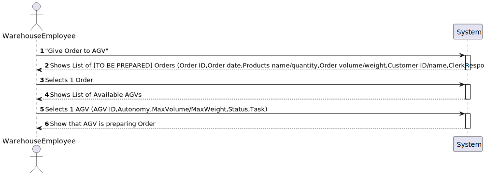
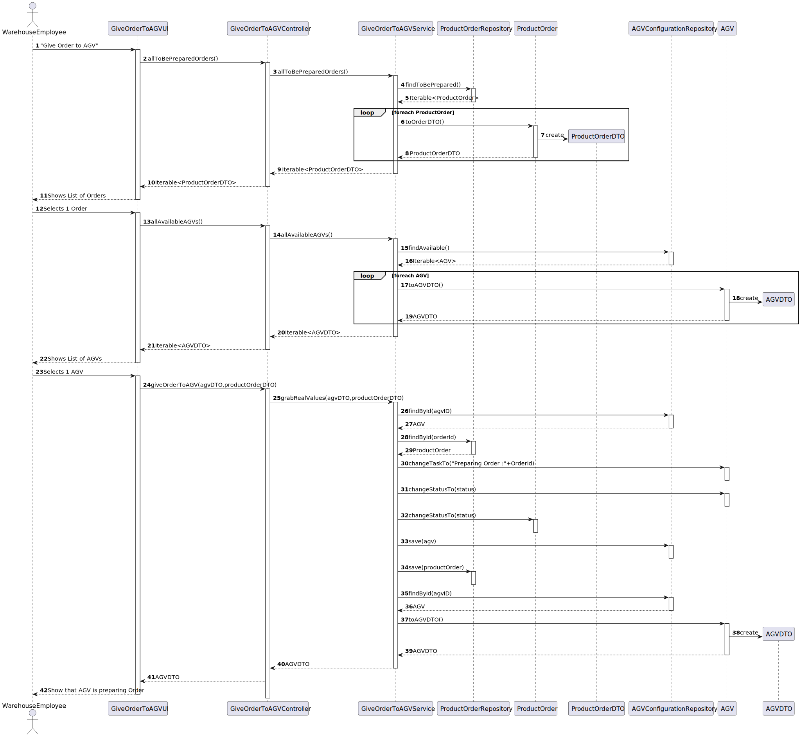

#US 2003 - As Warehouse Employee, I want to associate orders with AGVs
###### **All made by 1201427.**

------

## Requirements

>###US definition on backlog:
>
>As Warehouse Employee, I want to access the list of orders that need to be prepared by an AGV and be able to ask/force any of those orders to be immediately prepared by an AGV available.
>
>- Acceptance Criteria / Comments
>  - Orders info to show employee- [ID][Date][Customer ID/name][Total][Product names and quantity][orderVolume][orderWeight]
>  - AGVs info to show employee- [ID][Autonomy][MaxVolume][MaxWeight][Status] Status needs to be available

>###Customer Specifications and Clarifications:
>
> **Q:** Regarding US2003, the development team was wondering if the warehouse employee chooses the intended AGV available to prepare the specific order or if it should be assigned to any AGV available without even asking the warehouse employee.
>
> **A:** **In the scope of US 2003, the AGV is selected by the warehouse employee from the ones that are available and are able to perform the task.**
>
>-----
> **Q:** It is mentioned that the warehouse is able to force a certain task to a certain AGV, but can this only happen when the AGV is free, or can the warehouse employee cancel a task and assign a new one.
>
> **A:** **In the scope of US 2003, the AGV is selected by the warehouse employee from the ones that are available and are able to perform the task. Tasks cannot be manually cancelled.**
>
>-----
> **Q:** Despite in the provided sprint user stories asking for the digital twin in a web dashboard along with its status and position, in user stories of the next sprint it is said that the development of the movement of the AGV is needed which causes a minor confusion. My question is in this sprint is it required to create the movement of the AGV?
>
> **A:** **On Sprint C, the web dashboard needs to be thought and ready to show the current AGVs position, which is read from some where. Further, on sprint D, when simulating the AGV movement the AGV position will change and, therefore, we will be able to see the AGVs position changing accordingly on the web dashboard.**
>
> **Notice that, this is an integrative project developed following an iterative and incremental process. So, at the end, the pieces need to fit well together.**
> 
>-----
> **Q:** Despite in the provided sprint user stories asking for the digital twin in a web dashboard along with its status and position, in user stories of the next sprint it is said that the development of the movement of the AGV is needed which causes a minor confusion. My question is in this sprint is it required to create the movement of the AGV?
>
> **A:** **No! Preferably, the dashboard should be an approximation to what is depicted on Figure 8 of the specifications document.**
>
>-----
> **Q:** Regarding this feature, what would you consider to be its complete state, that is, what would be the criterion to define whether or not this feature was functional?
>
> **A:** **The warehouse employee is able to (i) select an order that needs to be prepared; (ii): select the AGV from the ones that are available and able to perform the task; (iii) the task is sent to the selected AGV and (iv) the order change its status.**
>
>-----
> **Q:** Knowing that in US2003 it is only mentioned that the Warehouse Employee will do this action, I would like to know if it is part of the System to allow users with greater skills and responsibilities (Warehouse Managers or Admins) to also perform the same task? If yes, which users?
>
> **A:** **No! There is not such need.**
>
>-----
> **Q:** What would be the minimum information needed to show the User in order to select the desired Order? From our meeting the minimum result was the Identification , total Weigth and Total Volume. Should we add something else?
>
> **A:** **I would say that from the warehouse employee point of view, it is useful to show the order id, the order date, the customer id/name and order total.**
>
>**The total weight and total volume might be also useful if (s)he knows the AGV' characteristics. However, it is up to the system ensure that the selected AGV is capable of fulfilling the task.**

>###US Dependencies:
>
>- USs 2001 2002 and 1004

------
# Analysis

>- Orders info to show employee- [ID][Date][Customer ID/name][Total][Product names and quantity][orderVolume][orderWeight] Order needs to be To be prepared
>- AGVs info to show employee- [ID][Autonomy][MaxVolume][MaxWeight][Status] Status needs to be available

When the 2 are chosen order changes to Being-prepared and AGV changes to executing task and task to Doing order [Order ID]

###US 2003 SSD:

------
# Design

### Sequence Diagram:

------
#Tests

>Tests for DTOs

------
# Implementation

>just like SD

------
# Observations

>For now the only thing is, that I will put **any AGV capable of doing any Order** 
> because I believe if I would get an order with many products, and it passes the limit of 
> Max weight or volume it can do in **more than 1 journey**, but i only did **if the total order** 
> **values surpasses those max values the AGV can't do the Order**

