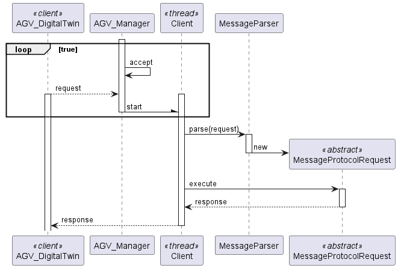

# US_5001_5002
### Pedro Sousa 1201428

# 1. Requisitos
_____
**US5001** As Project Manager, I want that the team start developing the input communication module of the AGV digital twin to accept requests from the "AGVManager".
--
**US5002** As Project Manager, I want that the team start developing the output communication module of the AGV digital twin to update its status on the "AGVManager".
--

--------
### 1.1 Especificações e esclarecimentos do cliente

> [Question:]()
> What type of communication do you want, i.e., what are the communications that you want to have between these two. Like AGV Manager says "Take a product" and AGV Digital Twin says "Taken"? Is it something like that? Or am i confused?
>
> [Awnser:]()
>The communication must follow the SPOMS2022 protocol.
>It is up to you and your team to devise a set of messages fulfilling the business requirements properly.

> [Question:]()
>Regarding the USs 1901,4001, 5001, and 5002, what would you consider its complete state, that is, what would be the criterion to define whether or not this US is functional?
>
> [Awnser:]()
>For all of those US, the communication between the two involved components must be implemented in accordance with the SPOMS2022. The requests processing can be somehow mocked. For instance, if processing a request implies saving some data to the database, the component can instead write such data to a log (mocking). Latter, on next sprint, the teams implement the interaction to the database.
>However, it is not advisable mocking everything, namely the components (internal) state. Notice that by mocking you are letting extra effort to the next sprint.
>

# 3. Design
_____

### 3.1. Realização da Funcionalidade

### 3.1.1 Sequence Diagram

### 3.2. Padrões Aplicados

* DDD - Domain Driven Design.
  >A elaboração do projeto começou logo com DDD em mente. O modelo de domínio foi elaborado com as regras de negócio e o overlay do DDD para representação de agregados, entities e roots seguindo as regras necessárias.

* GRASP
  >Com cada representação de um ator ou user story, o GRASP era sempre tido em consideração, visto ser uma base fundamental para o bom desenvolvimento do projeto.
  > Quer seja o Information Expert, Low coupling/High cohesion ou o conceito de controller, todos estes princípios estão bastante presentes na mente dos elementos do grupo.

* SOLID
  > O SOLID esteve present principalmente com o Single Responsability Principle, sendo que foi sempre tido em atenção as responsabilidades que uma classe deve ter.
  >Já implementado com o projeto base de EAPLI, a Interface Seggregation Principle veio-se provar útil e esclarecedora, tendo em conta os diversos repositórios que tiveram que ser criados.

# 4. Implementação

> VPN ISEP - 
> https://rede.dei.isep.ipp.pt/usermanual-en/vpn.html
> 
> Servidor ISEP - 
> https://rede.dei.isep.ipp.pt/usermanual-en/vpn.html
> 
> IP ADDRESS server - 10.9.22.140/16
>
> 

# 5. Integração/Demonstração

> Nada a apontar.

# 6. Observações

> Nada a apontar.

