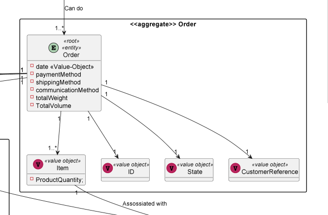
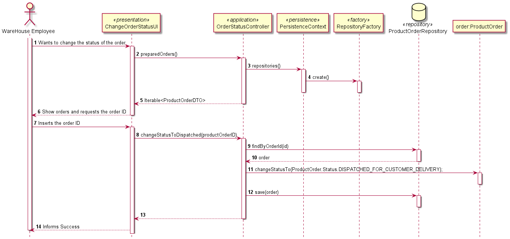

# US1501
### Vasco Azevedo 1202016

# 1. Requisitos
_____
**US2004** As Warehouse Employee, I want to access the list of orders that have already been prepared by the AGVs and be able to update any of those orders as having been dispatched for customer delivery.

### 1.1 Especificações e esclarecimentos do cliente

> [Question:](https://moodle.isep.ipp.pt/mod/forum/discuss.php?d=16330)
>Dear Client
>
> Regarding this feature, what would you consider to be its complete state, that is, what would be the criterion to define whether or not this feature was functional?
>
> Best Regards
>
>Diogo Dias - 2DDG4
>
> [Awnser:](https://moodle.isep.ipp.pt/mod/forum/discuss.php?d=16330)
>Being the US 2004 as follows
>
>"As Warehouse Employee, I want to access the list of orders that have already been prepared by the AGVs and be able to update any of those orders as having been dispatched for customer delivery. "
>
>it seems the criteria you are looking for is somehow obvious: the status of the selected order(s) changed from "already been prepared by the AGV" to "dispatched for customer delivery".

# 2. Análise
_____

### 2.1 Excerto do Modelo de Domínio

# 3. Design
_____

### 3.1. Realização da Funcionalidade

A implementação desta User Story permite criar uma funcionalidade ao WareHouse Employee para listar as orders que estão prepared
e alterar o seu status para delivered to costumer.

### 3.2 Diagrama de Sequência

### 3.3. Padrões Aplicados

* DDD - Domain Driven Design.
  >A elaboração do projeto começou logo com DDD em mente. O modelo de domínio foi elaborado com as regras de negócio e o overlay do DDD para representação de agregados, entities e roots seguindo as regras necessárias.

* GRASP
  >Com cada representação de um ator ou user story, o GRASP era sempre tido em consideração, visto ser uma base fundamental para o bom desenvolvimento do projeto.
  > Quer seja o Information Expert, Low coupling/High cohesion ou o conceito de controller, todos estes princípios estão bastante presentes na mente dos elementos do grupo.

* SOLID
  > O SOLID esteve present principalmente com o Single Responsability Principle, sendo que foi sempre tido em atenção as responsabilidades que uma classe deve ter.
  >Já implementado com o projeto base de EAPLI, a Interface Seggregation Principle veio-se provar útil e esclarecedora, tendo em conta os diversos repositórios que tiveram que ser criados.

### 3.4. Testes

> Não foram realizados testes visto que não foi implementada nenhuma classe de dominio

# 4. Implementação
_____
> Não houve grandes dificuldades na implementação desta us visto que
> so foi necessário implementar uns métodos.

# 5. Observações
_____
>Nada a apontar

