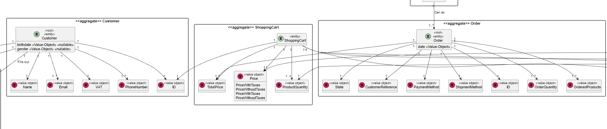
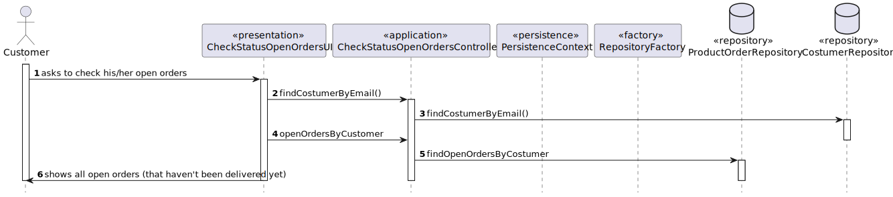

# US1502 
### Sérgio Lopes 1200625

# 1. Requisitos
_____
**US1502** As Customer, I want to view/check the status of my open orders.

**After talking with teacher Paulo Maio about our number of rcomp students, he said that US1901 was
not mandatory and in order to persist the shopping cart, we should save it on our database. As we have done, in the previouse
Sprint on US1501**

### 1.1 Especificações e esclarecimentos do cliente

> [Question:](https://moodle.isep.ipp.pt/mod/forum/discuss.php?d=16984#p21765)
> Dear client,
>
>In the US 1502, it is asked to "view/check the status of my open orders", can you clarify if the open orders are all the orders that have been created or if it is orders with a specific status.
>
>Best regards,
>
>Group 3 2DF
>
> [Awnser:](https://moodle.isep.ipp.pt/mod/forum/discuss.php?d=16984#p21770)
> It is all orders that have not been delivered to the customer yet.

# 2. Análise
_____

### 2.1 Excerto do Modelo de Domínio

# 3. Design
_____

### 3.1. Realização da Funcionalidade

Esta funcionalidade teve como objetivo dar a possibilidade aos clientes de ver os estados de todas as suas encomendas
abertas, que ainda não têm o estado de "delivered" ou seja que ainda não foram entregues ao cliente.

### 3.2 Diagrama de Sequência

### 3.3. Padrões Aplicados

* DDD - Domain Driven Design.
  >A elaboração do projeto começou logo com DDD em mente. O modelo de domínio foi elaborado com as regras de negócio e o overlay do DDD para representação de agregados, entities e roots seguindo as regras necessárias.

* GRASP
  >Com cada representação de um ator ou user story, o GRASP era sempre tido em consideração, visto ser uma base fundamental para o bom desenvolvimento do projeto.
  > Quer seja o Information Expert, Low coupling/High cohesion ou o conceito de controller, todos estes princípios estão bastante presentes na mente dos elementos do grupo.

* SOLID
  > O SOLID esteve present principalmente com o Single Responsability Principle, sendo que foi sempre tido em atenção as responsabilidades que uma classe deve ter.
  >Já implementado com o projeto base de EAPLI, a Interface Seggregation Principle veio-se provar útil e esclarecedora, tendo em conta os diversos repositórios que tiveram que ser criados.

# 4. Implementação
_____
> Para a resolução desta User Story foi necessário obter na base de dados, através de uma query o cliente que estava logado na sessão para
> poder se ir buscar as encomendas que o mesmo ainda tem abertas. Por fim, apenas foi necessário fazer-se uma query que
> que procura na base de dados, todas as orders deste mesmo cliente e dessas orders todas apenas apresentar as mesmas que ainda
> não foram entregues, de forma a corresponder em pleno o pedido pela User Story.

# 5. Observações
_____
> A resolução desta User Story foi acessível dado todos os conhecimentos obtidos ao longo deste semestre.

