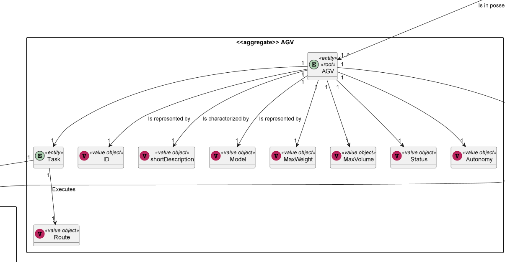

# US 5004
### Pedro Sousa 1201428

# 1. Requisitos
_____

**US5004** - As Project Manager, I want the output communications (of the AGV Digital Twin) made through the SPOMS2022 protocol to be secured/protected.

--------
### 1.1 Especificações e esclarecimentos do cliente

> [Question:]()
> Should the AGV Digital Twin be able to access the database for tasks or is that done solely through the AGV Manager, sending all the information through the CMD_API?
>
> [Awnser:]()
> No! Check Figure 2 of the specifications' document. The AGV does not communicate directly with the orders database. You solution must conform this representation.

> [Question:]()
> We assumed that the orders placed by the Sales Clerk should be communicated to the AGVManager through the REQUESTS_API and added to the queue. Is this correct or should the AGV Manager just look into the database for new orders?
>
> [Awnser:]()
> What you are saying is possible according to Figure 2. But, doing it following one approach or another is a technical decision. Evaluate pros and cons of both options.

> [Question:]()
> For orders placed by the Customer, are these communicated to the AGV Manager through the REQUESTS_API or, again, through constant lookup on the database?
> To clarify, I mean through the REQUESTS_API from the Orders Server to the AGV Manager, after the former saving the order on the database.
>
> [Awnser:]()
> Such possibility is not feasible according Figure 2. This might help you to make a decision regarding Q2.

> [Question:]()
> what is the actual purpose of the Requests_API then? What type of requests are to be sent from the BackOffice to the AGVManager?
>
> [Awnser:]()
> For instance, the Requests_API might be used to perform the US 2003.
> Notice that my previous answer concerning Q2 left the two approaches open.

# 2. Análise
_____

###  Excerto do Modelo de Domínio

# 3. Design
_____

### 3.1. Realização da Funcionalidade

### 3.1.1 Sequence Diagram

### 3.2. Padrões Aplicados

* DDD - Domain Driven Design.
  >A elaboração do projeto começou logo com DDD em mente. O modelo de domínio foi elaborado com as regras de negócio e o overlay do DDD para representação de agregados, entities e roots seguindo as regras necessárias.

* GRASP
  >Com cada representação de um ator ou user story, o GRASP era sempre tido em consideração, visto ser uma base fundamental para o bom desenvolvimento do projeto.
  > Quer seja o Information Expert, Low coupling/High cohesion ou o conceito de controller, todos estes princípios estão bastante presentes na mente dos elementos do grupo.

* SOLID
  > O SOLID esteve present principalmente com o Single Responsability Principle, sendo que foi sempre tido em atenção as responsabilidades que uma classe deve ter.
  >Já implementado com o projeto base de EAPLI, a Interface Seggregation Principle veio-se provar útil e esclarecedora, tendo em conta os diversos repositórios que tiveram que ser criados.

# 4. Implementação

> To implement SSL protocol both server and client must use SSL Sockets.
> A Keystore is rerquired to store certificates with public keys. Used to authenticate its owner side.
> A Truststore is required to certificate the public key. Used to authenticate the other side.

# 5. Integração/Demonstração

>The aim is to implement a SSL Handshake, which is basically when both Client and Server
   can trust eachother for data transferences. They must authenticate each other before said data is transfered. 
> When the AGVTwinServer recieves a resquest it will search its Keystore,
  sending its public key certificate to the Client, asking it to also show its public key. 
> Since mutual authentication is required, the Client will also
  search its own Keystore, sending the public key the server asked for. 
> Once both sides have presented their prublic keyes, they will use the Truststore
  to validate each others keyes. 
> If one of the sides cannot validate the key with the Trustore the HandshakeProcess will fail.

# 6. Observações

> This User Story it's the continuation of US 5002, so I had to modify that US for this User Story 5004 to work.

