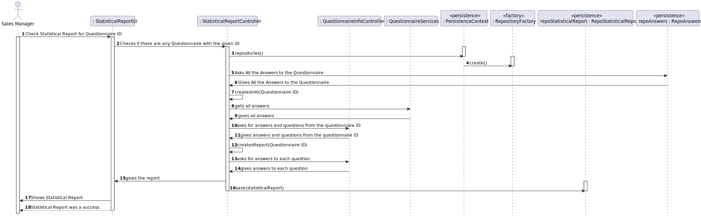

# US3002

### Tiago Freitas 1200628

# 1. Requisitos

_____
**US3002**

* As Sales Manager, I want to get a statistical report regarding a previously set up questionnaire.

* Acceptance Criteria 
  * Again, notice that the report should be generated considering the given questionnaire and the set of answers obtained until the current moment.

### 1.1 Especificações e esclarecimentos do cliente

> Q1: For this US, does the statistical report need to be shown to the SalesClerk or needs to be saved in some file too (p.e. text file)?
>
> A1: The important is to show the statistical report. 
> Saving the report is not seen as relevant since, at any time, the user might request to see the report again. 
> Notice that the information on which the report is computed is already persisted on the system.

> Q2: For this US, what are the types of statistical report that Sales Clerk want to see?
> 
> A2: Any report must have the basic:
— Universe Size (implies knowing the amount of users the survey was distributed to);
— Number of Responses Obtained
— % of responses obtained;
Further, something depending on the question type:- For “Single-Choice” questions:
  — Distribution (in %) of responses for each alternative (e.g.: A = 30%, B = 27%, C = 40%, Others = 3%)- For “Multiple-Choice” questions:
  — Distribution (in %) of responses for each alternative (e.g.: A = 30%, B = 27%, C = 40%, Others = 3%)
  — Distribution (in %) of combined responses (e.g.: A+B = 15%, A+C = 100%, B+C=100%, A+B+C=10%)- For “Sorting-Options” questions:
  — Distribution of the various hypotheses for each position (e.g.: 1st Place = A(40%) B (60%) C(0%); 2nd Place = A(50%) B(40%) C(10%); 3rd Place =A(10%) C(90%))- For “Scaling-Options” questions:
  — Distribution of each option by scale levels.
# 2. Análise

* It is not necessary to save the report into a file;
* Know how many times the questionnaire were answer;
* Know how many times questionnaire were given;
* Know most common answer;
* Know whats the most choosen multiple option;
* Know whats the most comon multiple choice combo;

### 2.1 Excerto do Modelo de Domínio

# 3. Design

_____

### 3.1. Realização da Funcionalidade

### 3.3. Padrões Aplicados

*Nesta secção deve apresentar e explicar quais e como foram os padrões de design aplicados e as melhores práticas.*

### 3.4. Testes

# 4. Implementação
> pesquisamos todos os quetionários
> 
> escolhemos pelo id
>
> recolhemos toda a informação relacionado com as respostas ao questionário indicado
>
> filtramos as respostas pelo id da secção, id da questão
>
> contamos quantas vezes é efetuado o questionário pelos utilizadores
> 
> contamos a percentagem de respostas e verificamos qual a mais comum
> 
> apresentamos a informação ao sales manager e é efetuada a gravação na base de dados

# 5. Integração/Demonstração

> sales manager escolhe um questionário
>
> a função vai encontar o questionário em quetão
>
> faz o report automático
>
> apresenta o report relacionado ao questionário indicado com a percentagem de cada resposta, a mais comum e o número de visualizações do questionário
>

# 6. Observações

* Enter the Sales Manager Menu
* 

