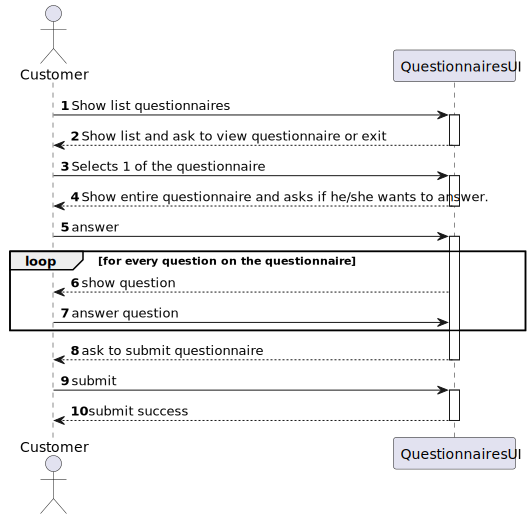
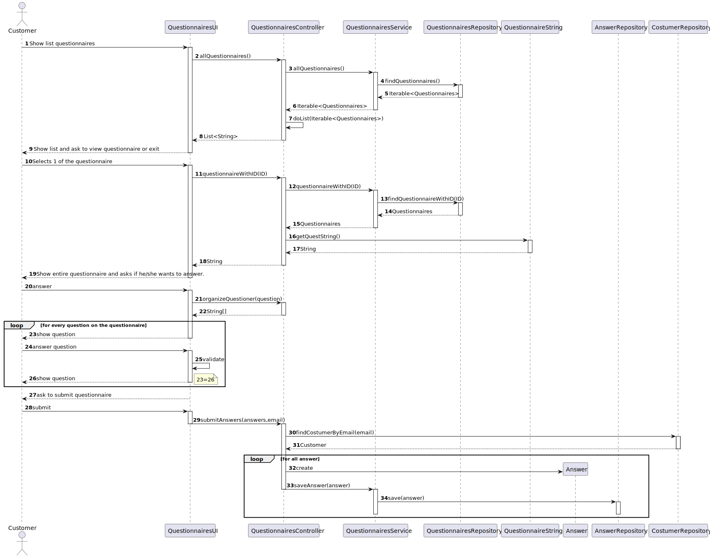

#US 3501 - As Customer, I want to get the list of questionnaires that the system is asking me to answer and be able to answer any of those questionnaires.
###### **All made by 1201427.**

------

## Requirements

>###US definition on backlog:
>
>As Customer, I want to get the list of questionnaires that the system is asking me to answer and be able to answer any of those questionnaires.
> 
>Acceptance Criteria / Comments
> 
>- Notice that the UI should be generated dynamically in accordance to the given questionnaire. I.e. que UI is generated by interpreting the input questionnaire.
The answers should be saved in a raw text format to be further processed/analyzed.
>  
>  

>###Customer Specifications and Clarifications:
>
> **Q:** The US says: "As Customer, I want to get the list of questionnaires that the system is asking me to answer and be able to answer any of those questionnaires."
>
>Previously the customer had said that there were keywords in the creation of the questionnaire.... How can we relate those keywords to a client?
> 
> Or is there a more direct relationship between the customer and the questionnaire, for example:
> 
> - A questionnaire is created about sneakers.
> - The client orders some sneakers, so the questionnaire about sneakers will appear.
> 
> **A:** The "relationship" between the questionnaire and customers is somehow established when creating the questionnaire (US 3001), namely when the user is specifying the criteria that target customers must met (e.g.: have ordered a given product; belong to a given age group).

>###US Dependencies:
>
>- USs 3000 3001 

------
# Analysis

###US 2003 SSD:

------
# Design

### Sequence Diagram:

------
# Implementation

>my process was get the questionnaires and make a list with the ids and show to 
> customer he selects and the controller gets the string with the full questionnaire then asks if he/she wants to answer if yes then the ui asks the controller to divide the questionnaire  
>and the UI shows bit by bit the questionnaire and the costumer answers  when its done it ask if he wants to submit and then saves in repository
------
# Observations

>a minha ideia nesta US é dar ao custumer os questionarios ele 
> escolhe para ver e se ele quizer responder depois tem essa opçao supostamente 
> de inicio o custumer nao deveria ter todos os questionarios so depois de fazer 
> algo no programa que faria sentido o questionario ser dado ao customer é que
> ele fazia mas para simplificar vou fazer com que todos os questionarios sejam 
> acessiveis aos custumers independemente se for inrelevante ao custumer responder
> pois caso contrario teria que mudar muita da informaçao que é pedida e gardada na base de dados
> segundo ao asseitar o questionario ele vai de questao a questao responder ao 
> questionario comforme as restrictions que tiver 

