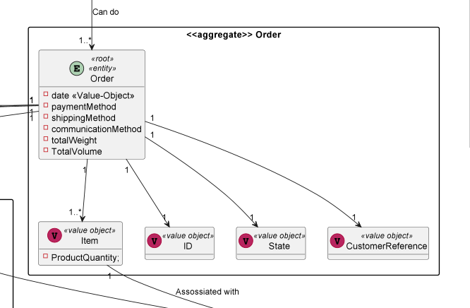
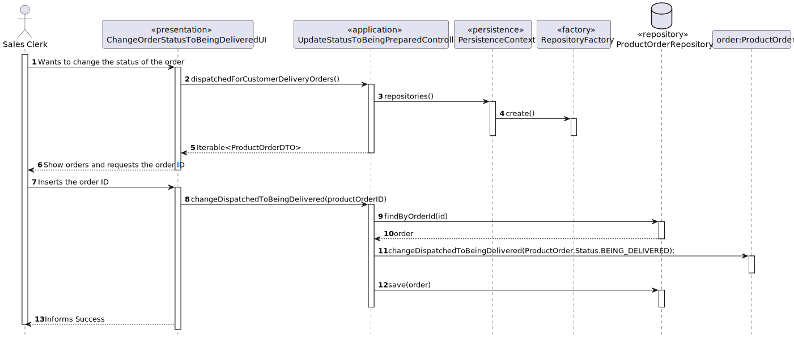

# US1006 
### Sérgio Lopes 1200625

# 1. Requisitos
_____
**US1006** As Sales Clerk, I want to access a list of orders that had been dispatched for customer delivery and be able 
to update some of those orders to as being delivered.

### 1.1 Especificações e esclarecimentos do cliente

> [Question:](https://moodle.isep.ipp.pt/mod/forum/discuss.php?d=16695#p21422)
> Dear Client,
>
>We wanted to know which attributes are needed on the shopping cart to show to the user (customer)?
>
>Best Regards,
>
>G03 2DF
>
> [Awnser:](https://moodle.isep.ipp.pt/mod/forum/discuss.php?d=16695#p21451)
> Come on, you must have/acquire autonomy to decide this based on the business description already made.
>
>In addition, you can always put yourself in the role of a customer (and not of a developer) and think a little about
>what information you, as a customer, would like to see. And that's it, that's the information you have to show.

# 2. Análise
_____

### 2.1 Excerto do Modelo de Domínio

# 3. Design
_____

### 3.1. Realização da Funcionalidade

A implementação desta User Story a partir de uma lista de encomendas (orders) que estejam no estado de "had been dispatched for customer delivery" (encomendas que já foram enviadas
para o cliente) para depois escolher as encomendas que o Sales Clerk desejar atualizar para o estado de "being delivered" (a ser entregue).

### 3.2 Diagrama de Sequência

### 3.3. Padrões Aplicados

* DDD - Domain Driven Design.
  >A elaboração do projeto começou logo com DDD em mente. O modelo de domínio foi elaborado com as regras de negócio e o overlay do DDD para representação de agregados, entities e roots seguindo as regras necessárias.

* GRASP
  >Com cada representação de um ator ou user story, o GRASP era sempre tido em consideração, visto ser uma base fundamental para o bom desenvolvimento do projeto.
  > Quer seja o Information Expert, Low coupling/High cohesion ou o conceito de controller, todos estes princípios estão bastante presentes na mente dos elementos do grupo.

* SOLID
  > O SOLID esteve present principalmente com o Single Responsability Principle, sendo que foi sempre tido em atenção as responsabilidades que uma classe deve ter.
  >Já implementado com o projeto base de EAPLI, a Interface Seggregation Principle veio-se provar útil e esclarecedora, tendo em conta os diversos repositórios que tiveram que ser criados.
  

# 4. Implementação
_____
> Para a implementação desta US, foi necessário criar uma query que permite procurar todas as orders ativas que se 
> encontram com o estado de "had been dispatched for customer delivery" para se tornar possível escolher um deles para dar update
> para "being delivered". Sendo que, a mesma order,é depois atualizado na base de dados com o seu novo estado.

# 5. Observações
_____
> Não foram encontradas dificuldades na execução desta User Story visto que se tratava de replicar a mesma funcionalidade no 
> Sprint passado, sendo que aoenas foi necessário fazer algumas mudanças de modo a conseguir executar esta funcionalidade completamente.

